# 生物拼接（Bio Splice）· 全项目总结

> 返回[项目首页](README.md) ｜ [全项目规划](PLAN.md)

**交付：12 个子主题 × 5 期 = 60 期，135 件成品，60 张期合并图，12 张子主题合并图。**
所有成品都经 `score.py` 判定 ✅ 后才由 `curate.py` 进入期目录，无一例外。

---

## 一、交付清单

| 子主题 | 组 | 期 | 成品 | 对照 | 均分 | 合图 | 状态 |
|--------|----|----|------|------|------|------|------|
| [cat-eagle](subjects/cat-eagle/README.md) 猫 + 鹰 | 甲 | 5 | 14 | 6 | 4.35 | [`sheet.jpg`](subjects/cat-eagle/sheet.jpg) | ✅ |
| [dragon-nines](subjects/dragon-nines/README.md) 龙 · 九似 | 甲 | 5 | 10 | 5 | 4.24 | [`sheet.jpg`](subjects/dragon-nines/sheet.jpg) | ✅ |
| [turtle-snake](subjects/turtle-snake/README.md) 龟 + 蛇（玄武） | 甲 | 5 | 13 | 5 | 4.74 | [`sheet.jpg`](subjects/turtle-snake/sheet.jpg) | ✅ |
| [fish-bird](subjects/fish-bird/README.md) 鱼 + 鸟（鲲鹏） | 甲 | 5 | 11 | 5 | 4.22 | [`sheet.jpg`](subjects/fish-bird/sheet.jpg) | ✅ |
| [deer-crane](subjects/deer-crane/README.md) 鹿 + 鹤 | 甲 | 5 | 9 | 5 | 4.16 | [`sheet.jpg`](subjects/deer-crane/sheet.jpg) | ✅ |
| [lichen](subjects/lichen/README.md) 地衣 = 真菌 + 藻 | 乙 | 5 | 11 | 5 | 4.84 | [`sheet.jpg`](subjects/lichen/sheet.jpg) | ✅ |
| [cordyceps](subjects/cordyceps/README.md) 冬虫夏草 = 菌 + 虫 | 乙 | 5 | 11 | 5 | 4.80 | [`sheet.jpg`](subjects/cordyceps/sheet.jpg) | ✅ |
| [flytrap-fang](subjects/flytrap-fang/README.md) 捕蝇草 + 动物器官 | 乙 | 5 | 11 | 5 | 4.90 | [`sheet.jpg`](subjects/flytrap-fang/sheet.jpg) | ✅ |
| [flower-bird](subjects/flower-bird/README.md) 花 + 鸟 | 乙 | 5 | 12 | 5 | 4.62 | [`sheet.jpg`](subjects/flower-bird/sheet.jpg) | ✅ |
| [tree-beast](subjects/tree-beast/README.md) 树 + 兽 | 乙 | 5 | 11 | 5 | 4.59 | [`sheet.jpg`](subjects/tree-beast/sheet.jpg) | ✅ |
| [wing-atlas](subjects/wing-atlas/README.md) 翅 · 图鉴 | 丙 | 5 | 11 | 4 | 4.72 | [`sheet.jpg`](subjects/wing-atlas/sheet.jpg) | ✅ |
| [horn-atlas](subjects/horn-atlas/README.md) 角 · 图鉴 | 丙 | 5 | 11 | 4 | **5.00** | [`sheet.jpg`](subjects/horn-atlas/sheet.jpg) | ✅ |
| **合计** | | **60** | **135** | 59 | | **72 张** | |

**均分前三**：`horn-atlas` 5.00（零失败）、`flytrap-fang` 4.90、`lichen` 4.84。
**均分后三**：`deer-crane` 4.16、`fish-bird` 4.22、`dragon-nines` 4.24——都是**供体与底座同形**或**需要腾典范结构**的选题。

---

## 二、各子主题合图（点击缩略图看原图）

**每张合图 = 该子主题的 5 期，每期一行**（行内是这一期的全部成品，含对照）。
想看**单期**的大图，去 `subjects/<子主题>/period-NN/sheet.jpg`；
想一次重生全部 72 张合并图：`bash make_sheet.sh all`。

### 甲组 · 同界跨界（动物 × 动物）

| 猫 + 鹰<br>5 期 / 14 成品 | 龙 · 九似<br>5 期 / 10 成品 | 龟 + 蛇（玄武）<br>5 期 / 13 成品 |
|---|---|---|
| [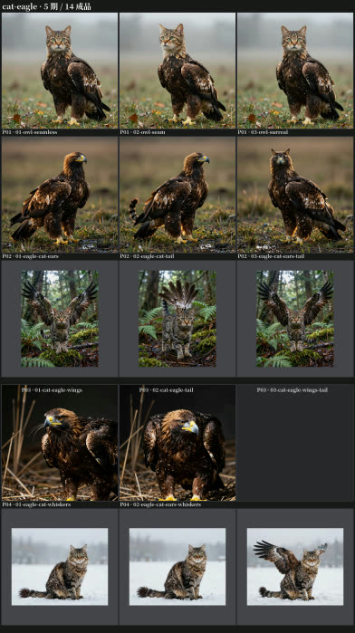](subjects/cat-eagle/sheet.jpg) | [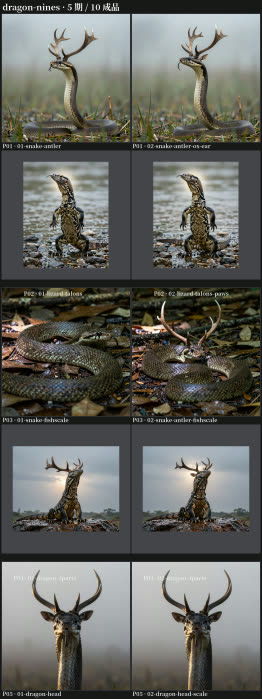](subjects/dragon-nines/sheet.jpg) | [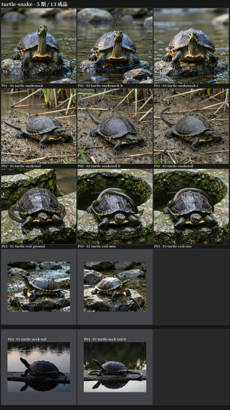](subjects/turtle-snake/sheet.jpg) |

| 鱼 + 鸟（鲲鹏）<br>5 期 / 11 成品 | 鹿 + 鹤（鹿鹤同春）<br>5 期 / 9 成品 |  |
|---|---|---|
| [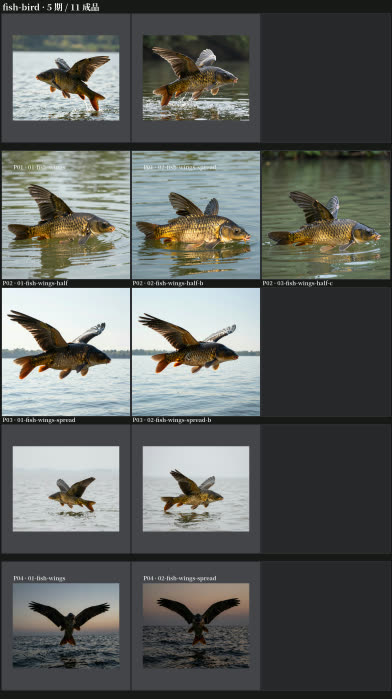](subjects/fish-bird/sheet.jpg) | [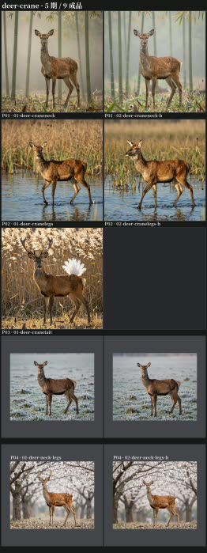](subjects/deer-crane/sheet.jpg) | |

### 乙组 · 跨域拼接（动物 × 植物 × 菌）

| 地衣 = 真菌 + 藻<br>5 期 / 11 成品 | 冬虫夏草 = 菌 + 虫<br>5 期 / 11 成品 | 捕蝇草 + 动物器官<br>5 期 / 11 成品 |
|---|---|---|
| [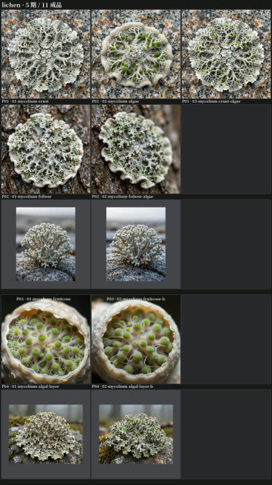](subjects/lichen/sheet.jpg) | [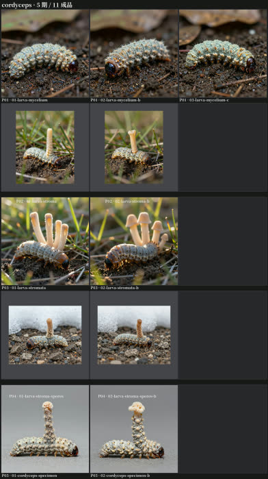](subjects/cordyceps/sheet.jpg) | [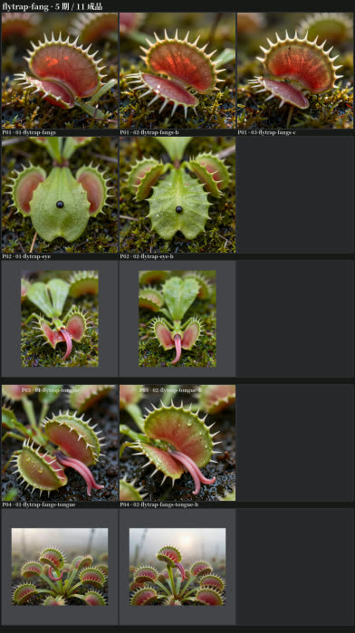](subjects/flytrap-fang/sheet.jpg) |

| 花 + 鸟<br>5 期 / 12 成品 | 树 + 兽<br>5 期 / 11 成品 |  |
|---|---|---|
| [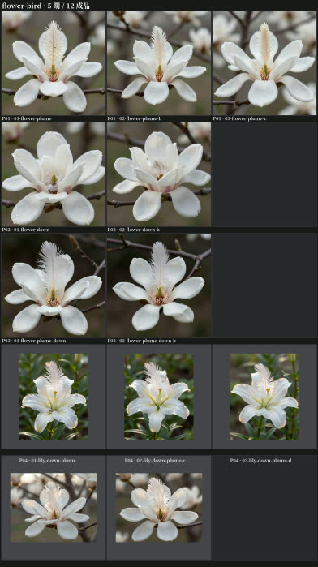](subjects/flower-bird/sheet.jpg) | [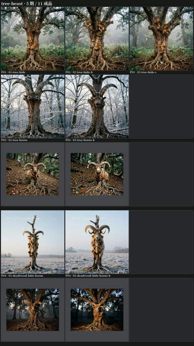](subjects/tree-beast/sheet.jpg) | |

### 丙组 · 部件图鉴（同一底座轮换器官）

| 翅 · 图鉴<br>5 部分 / 11 成品 | 角 · 图鉴<br>5 部分 / 11 成品 |  |
|---|---|---|
| [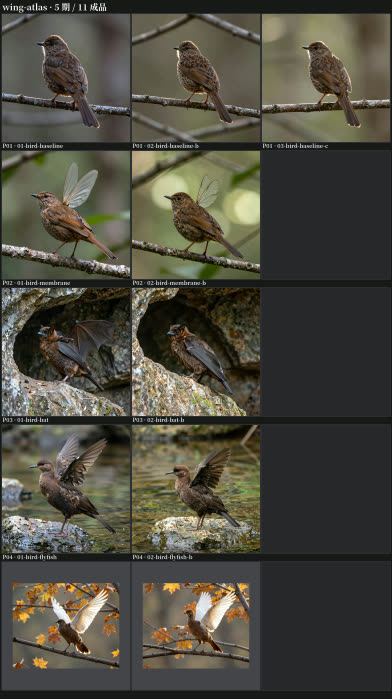](subjects/wing-atlas/sheet.jpg) | [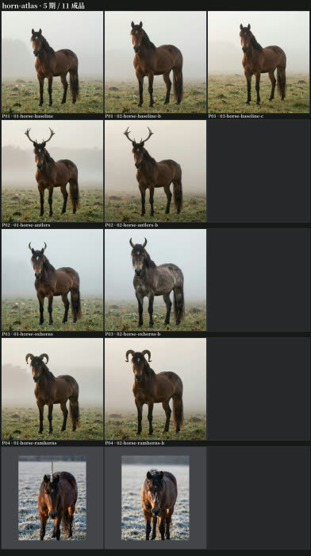](subjects/horn-atlas/sheet.jpg) | |

> 缩略图是 `sheet-thumb.jpg`（箱式缩采样 + JPEG，约 50–85KB）；
> 原图 `sheet.jpg` 是 1568×2796 的长条，**每期一行**。

## 三、机制结论总表（本项目沉淀的核心知识）

> 编号沿用各子主题实测时给出的编号（51–110）。下表按**用途**重排，是这套机制的"使用手册"。

### A. 选题：先判断"能不能落"

| 编号 | 结论 |
|------|------|
| **92** | 🎯 **底座的形态自由度决定移植难度**：越定型（鹿/鱼）越难，越像原料（菌丝体）越易 |
| **99** | 🎯 **判据落在「落点」，不是「整体」**：整体定型不妨碍移植，只要落点本身是空的或只是附属属性 |
| **105** | 🎯 **两条独立门槛**：①落点是不是典范结构 ②这件需要什么承载面——**两个都要问** |
| **107** | 🎯 **供体的语义类别必须与落点功能匹配**：形状像不够，**语义要对**（鱼鳍 vs 飞鱼鳍） |
| 83 / 87 / 89 | **典范结构改得动形状、改不动材质**（鹿腿、鱼鳍、猫掌、蛇鳞、花瓣）；删掉描述也会被补回来 |
| 90 | 空位是**必要**条件、不是**充分**条件；还要看供体件的**辨识度** |
| 91 | 供体优先级：**不同形 > 同形** |
| 110 | 形态可以**补偿**语义的小偏差（独角鲸的长牙不是角，但"一支向上的螺旋"被接受了） |

### B. 写法：句子怎么写才被执行

| 编号 | 结论 |
|------|------|
| 56 / 66 | 移植成败首先看**底座有没有占位**；占位可以**腾出** |
| **96 / 100** | 🎯 **可腾出的是「属性」（体表质感、颜色、边界附属物）；腾不出的是「结构」（器官、肢体）** |
| 57 | 危险的是**整体名词点名**（`X 的身体`），不是提到物种 |
| 69 | 复合部件要**拆开写** |
| **81** | 🎯 **空间关系从句失效，改名词短语**：`X wrapped around Y` 空操作，`X coils around Y` 才执行 |
| 103 | 写法要**连着落点一起看**（同一个"覆盖式"在虫体表成立、在花瓣上失效） |
| 82 | "该成却没成"时，**先怀疑写法，再怀疑占位** |

### C. 排布：多件同体怎么摆

| 编号 | 结论 |
|------|------|
| 59 / 68 | **同区域最多叠两处**，跨区域可叠加；约束的自变量是**区域分布**而不是件数 |
| 74 / 97 | 部位需要**载体结构**；**从体表长出的件不需要承载结构**（角、子座、羽翎） |
| 108 | **图鉴类子主题要有「基准部分」**（第 1 部分不放移植件，作后四部分的参照） |

### D. 呈现：机位、光线、生境、媒介

| 编号 | 结论 |
|------|------|
| 70 / 72 | **期内恒定 + 期间各异**；只换呈现层则机制结论照旧成立 |
| **85 / 86** | 🎯 **生境是硬约束**：部件与场景语义冲突时，模型**保场景、丢部件**；兼容性还**按区域**判断 |
| **79** | 姿态句必须对目标部位**保持沉默**（提到什么，对照也会长出什么） |
| **80** | 呈现层**不是中性的**：机位/画幅会改变移植结果 |
| 93 | **尺度也是呈现层**（微距题材要换掉整套取景句与摄影层） |
| 94 | **呈现可以救弱期**（拟剖面把"藻层"从最难变成最好） |
| 98 | **换呈现媒介 = 收官期的低成本升级**（生态照 → 标本照） |
| 95 | 对照已经把一半做完了就要**扣分** |

### E. 流程：怎么做得快、做得稳

| 编号 | 结论 |
|------|------|
| 76 | **一轮只放一个底座**（同轮对照只对同底座的镜头有效） |
| 84 | **多 take 是低成本的可重复性检验** |
| 88 | 「唯一可用部件」也能撑起一个子主题（用**呈现层的自变量**当期间差异） |
| **102 / 106** | 🎯 **换底座要重新验命中率**；是否降命中率**取决于落点性质**（属性/空面稳，几何敏感的不稳） |
| **109** | 🎯 **门槛可以主动凑齐**：把 99/97/96/107 一次性对齐 → 零失败（`horn-atlas`） |
| 51 附注 | **判定必须落到局部放大**，缩略图会骗人 |

---

## 四、否定结论清单（做不成的那些，同样有价值）

| 子主题 | 部位 | 结果 | 原因 |
|--------|------|------|------|
| dragon-nines | D2 驼头 / D3 兔眼 | **0%** | 底座物种名词**既是占位又是锚**；换头双向死局（73/75） |
| dragon-nines | D8 虎掌 | 未成立 | 足形被蜥蜴占住：改得动爪形、改不动肉垫 |
| fish-bird | 鸟尾羽 / 鸟羽覆体 | **0%** | 尾位是**典范结构**；羽覆体属同材质替换 |
| deer-crane | 羽冠 / 喙 / 翼 | 未做 | 头部件（73）、鹿无翼基（74） |
| flower-bird | 羽替花瓣 | **0%** | 花瓣是典范结构（三种写法全灭） |
| tree-beast | 兽足 | **0%** | 落点是结构 + 「足」需要关节（**两条门槛都不过**） |
| wing-atlas | 鱼胸鳍 / 枫树种子翅 | 0% / 部分 | **语义类别不匹配**（无飞行语义） |
| flytrap-fang | 爪 | 未做 | 捕蝇草无四肢（无承载面） |
| cat-eagle | 鹰头猫（period-06） | 作废 | 换头方向不可行（73） |
| 全体 | 「眼」类部件 | 不做 | 小部件 + 同材质替换 + 头部件族（原 `eye-atlas` 因此改写为 `horn-atlas`） |

---

## 五、工具链与复现

```
projects/bio-splice/
├── PLAN.md / SUMMARY.md / README.md
├── run_round.py      入口（--subject 选子主题）
├── roundkit.py       通用机械（跑轮 / 存档 / prompt 分句换行）
├── curate.py         成品提升 work/ → period/，写 manifest.json
├── score.py          客观报警 + 主观五维评分，按门槛判定能否进成品
├── make_sheet.sh     合并图（round / period / subject / all）
└── subjects/<子主题>/{README.md, parts.md, rounds.py, rounds/, period-NN/}
```

```bash
# 复现任意一期
python3 run_round.py --subject horn-atlas 2 --dry     # 看逐字 prompt
python3 run_round.py --subject horn-atlas 2           # 生成（固定 seed）
python3 score.py --round work/horn-atlas/r2/round.json \
    --scores work/horn-atlas/r2/scores.json --control base-horse \
    --region head=350,80,400,400 --audit-sheet subjects/horn-atlas/rounds/ha-r2-audit.jpg \
    -o subjects/horn-atlas/rounds/ha-r2-review.md
python3 curate.py --period subjects/horn-atlas/period-02 \
    --from work/horn-atlas/r2/round.json --pick horse-antlers=01-horse-antlers \
    --control base-horse=controls/horse --note "…"
bash make_sheet.sh period subjects/horn-atlas/period-02
```

**可复现性**：全部轮次固定 seed；实测同一 prompt/seed/画布下**解码像素逐字节相同**
（`work/` 因此不进仓库）。引擎：Z-Image-Turbo（1024²/1280²，steps 12，约 25 s/张）。

---

## 六、已知不足与后续建议

1. **`cat-eagle` 期 02–05 的呈现**是事后重做的（原始五期共用一套秋日草甸），
   而 `deer-crane` 的四个期是"部分成立"仍未补做——**如果重做，建议按规律 99 换落点**。
2. **`lichen` 期 03（枝状地衣）**的底座自带分叉形态，移植件的边际贡献被"对照做了一半"摊薄，
   分数 4.55 已如实扣分；若追求满分可换一个不分叉的底座重做。
3. **规律 101（接缝决定可信度）仍是假设**：`flytrap-fang` 期 02 的眼只有 4.80（无眼睑/眼窝），
   假设补「窝/睑/接缝」能提高 C 分——**尚未验证**。
4. **未做的两项**：dragon-nines 的 D5「腹似蜃」（需先定视觉代理）、
   `tree-beast` 的「年轮 ↔ 骨」（内部结构，本册没做）。
5. **仓库体积**：本项目是图像密集仓，Gitee 配额 1024MB；
   合并图/审计图已用 JPEG、成品与对照用 PNG（JPEG 会引入 ≈1.21 的平均通道差、吃掉判据），
   需要**每推进 2–3 个子主题在 Gitee 上跑一次 Repository GC**（见项目 README 第九节）。

---

## 七、一句话结论

**「生物拼接」能不能做出来，不取决于模型有多强，而取决于选题是否尊重它已有的先验。**
把「落点是空面、不需要承载结构、无需腾占位、语义类别匹配」这四件事一次性对齐，
就能得到 `horn-atlas` 那样的零失败；任何一条不满足，就会得到 `deer-crane` 那样的"部分成立"。
**本项目 135 件成品与 10 条否定结论，共同构成了这张判据表。**

---

## 文档修订记录

| 日期 | 版本 | 变更内容 | 作者 |
|------|------|----------|------|
| 2026-10-05 | v1.0 | 全项目收尾总结：60 期 / 135 成品交付清单、机制结论总表（按用途重排 51–110）、否定结论清单、工具链与复现、已知不足 | 小七 |
| 2026-10-05 | v1.1 | 交付清单增「合图」直达列；新增「各子主题合图」一节（12 张缩略图，点击看原图，按甲/乙/丙分组） | 小七 |
